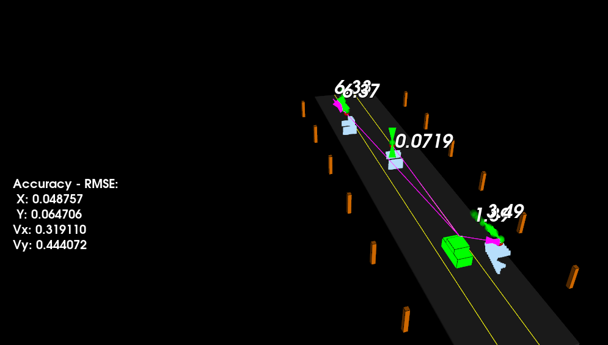

# SFND_Unscented_Kalman_Filter

Udacity course project which implements Unscented Kalman Filter algorithm to estimate state of cars around ego vehicle.

---

## Other Important Dependencies
* cmake >= 3.10
  * All OSes: [click here for installation instructions](https://cmake.org/install/)
  * cmake 3.22 is used in this project.
* make >= 4.1 (Linux, Mac), 3.81 (Windows)
  * Linux: make is installed by default on most Linux distros
  * Mac: [install Xcode command line tools to get make](https://developer.apple.com/xcode/features/)
  * Windows: [Click here for installation instructions](http://gnuwin32.sourceforge.net/packages/make.htm)
* gcc/g++ >= 5.4
  * Linux: gcc / g++ is installed by default on most Linux distros
  * Mac: same deal as make - [install Xcode command line tools](https://developer.apple.com/xcode/features/)
  * Windows: recommend using [MinGW](http://www.mingw.org/)
  * gcc/g++ 9 is used in this project.
 * PCL >= 1.9
   * PCL 1.12 is used in this project.

## Basic Build Instructions

1. Clone this repo.
2. Make a build directory: `mkdir build && cd build`
3. Compile: `cmake .. && make`
4. Run it: `./ukf_highway`